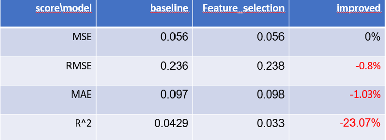

# Final Report

- Our Customers: Real estate agencies, insurance companies
- Team Members: Daniel Sabba - Data Scientist, Jonathan Erell, Project Leader, Yossi Gavriel - Customer Support

## Overview
Our company specializes in providing ML pipeline solutions to insurance companies and real estate agencies. Our goal is to help these businesses increase their income through the use of advanced ML techniques. Our solution includes a ML pipeline that addresses the common problems of unfairness and bias in models, as well as reducing the prediction runtime process and increasing overall performance.

Our pipeline includes several features that are designed to combat bias and unfairness in models. We use state-of-the-art techniques and tools to ensure that the models we provide are fair and unbiased. Additionally, our pipeline is designed to reduce the prediction runtime process, which means that our models can provide predictions much faster than traditional models. This can lead to significant improvements in the performance of the companies that use our solution.  

Overall, our solution is designed to help insurance companies and real estate agencies improve their performance and increase their income.
By addressing the common problems of unfairness and bias in models, reducing prediction runtime process, and increasing overall performance, our solution provides a powerful tool that businesses can use to achieve their goals.
Business clients in the field of insurance that use machine learning typically do so to improve their underwriting processes, fraud detection, and claims management.

## Business Domain

The business domain of our customer is the insurance and real estate industries. The insurance industry is a highly regulated and competitive market, in which companies provide financial protection against risks such as accidents, illnesses, and natural disasters. The real estate industry, on the other hand, involves the buying, selling, and renting of properties.

The insurance industry is a vital part of the economy, providing financial protection to individuals and businesses in the event of unexpected losses. Insurance companies use various types of models to underwrite risks and price policies, as well as to identify fraud and predict claims. The use of ML models in the insurance industry can help companies improve their underwriting and pricing processes, as well as detect fraud more efficiently.

The real estate industry is also a vital part of the economy, with the buying and selling of properties representing a significant part of GDP. The use of ML models in the real estate industry can help companies improve their property valuations, predict property prices, and assist with property management.

Our solution will be beneficial for the insurance companies and real estate agencies, as it will help them to improve their pricing and underwriting process, detect fraud and predict claims, property valuations, and assist with property management.

## Business Problems

The business problem that our solution aims to address is the issue of bias and unfairness in models used by insurance companies and real estate agencies. These industries rely heavily on data-driven decision making, and the use of ML models is becoming increasingly common. However, these models can be prone to bias and unfairness, which can lead to incorrect predictions and poor decision making.

One specific use case in the insurance industry is the underwriting process. Insurance companies use models to underwrite risks and price policies. However, if these models are biased, they may incorrectly assess the risk of certain individuals or groups, leading to higher prices for some and lower prices for others. This can result in unfair treatment of customers and can also lead to financial losses for the company.

Another use case in the real estate industry is the property valuations. Real estate companies use models to predict property prices and assist with property management. However, if these models are biased, they may undervalue or overvalue properties, leading to incorrect pricing decisions and financial losses for the company.

The exact use case for our solution is to decrease the bias and unfairness in the models used by insurance companies and real estate agencies. Our solution will improve the underwriting and pricing processes, detect fraud and predict claims, property valuations, and assist with property management. By providing

fair and unbiased models, our solution will enable these companies to make more accurate and fair decisions, leading to improved performance and increased income.

In summary, the business problem that our solution aims to address is the issue of bias and unfairness in models used by insurance companies and real estate agencies, which can lead to incorrect predictions, poor decision making, and financial losses for the company.

## Data Processing

Our pipeline's mission is to prepare the dataset for a regression task. The dataset contains both numeric and categorical features.

The first step in the pipeline is to replace the categorical features with one-hot encoding. This converts categorical variables into multiple binary variables, allowing them to be used in the model.

The second step is to use feature selection methods to remove redundant features from the dataset. We used multiple algorithms such as F-regression, R-regression, and mutual information regression to identify and select the most relevant features.

The third step is to remove outliers from the dataset using multiple algorithms. We used the Z-score method, IQR range, Local Outlier Factor (LOF) for multivariate outliers, and Angle-Based Outlier Detection (ABOD) method for multivariate outliers to identify and remove outliers.

The last step is to use the Dalex module to mitigate bias in the model by either resampling indices from the dataset or adding weights to specific samples. This step ensures that the model is less biased and more balanced.

The output of the pipeline is a cleaner dataset that is much more balanced, less biased, and probably smaller than the original dataset. This cleaned dataset is then used as the input for the regression model.

### Modeling, Validation

The results section of the final report presents the outcome of the step-by-step pipeline applied to the given dataset for a regression task. First, a baseline model was trained on the original dataset to establish a baseline for comparison.

**The first step** of the pipeline was to use feature selection to remove redundant features from the dataset. The results of this step, shown in an image, indicate that the model did not improve significantly but also did not worsen after removing 2 features from each dataset. This result is positive since almost 20% of the data was removed without harming the model. 

  
  

Figure 1: Feature Selection Method - Boston and French Motor Datasets

**The second step** was to remove outliers from the dataset using multiple methods such as Z-score, IQR range, and PyOD for univariate and multivariate features. The results, shown in an image, indicate that the model improved on both datasets after cleaning the dataset from outliers. Additionally, by cleaning a small amount of data, the model was made simpler and faster for later runs.

**The third step** was to measure the model's fairness for each feature by checking for bias towards a particular feature or subgroup. If bias was found, the method of resampling or reweighting the feature was applied during the fitting of the pipeline. The results, shown in an image, indicate that the model improved significantly for the Boston dataset and less so for the Motor dataset, making it more generalized and less biased. Features such as Indus, CRIM, and PTRATIO were identified as biased and reweighting them resulted in better results for the Boston dataset.

Finally, all the methods were combined in the order of feature elimination, outlier detection and removal, and unfairness detection. The results, to be discussed later, indicate that the model did not improve in terms of the MAE metric, but it was more generalized, less biased, and much faster.

## Solution Architecture
* **What data do we expect? Raw data in the customer data sources (e.g. on-prem files, SQL, on-prem Hadoop etc.)**
  * We are expecting that the clients data will be on-prem csv files (structured).
  * Sampled data enough for modeling 

* **What tools and data storage/analytics resources will be used in the solution**
  * Pandas for data storage
  * SKlearn's stat filters and models
  * SKlearn's pipeline for pipeline creation
  * Dalex package
  * PyOD package
  
* **How will the score or operationalized web service(s) (RRS and/or BES) be consumed in the business workflow of the customer? If applicable, write down pseudo code for the APIs of the web service calls.**
  * Our pipeline will be fused in each of the data-scientists day-to-day work, with easy implementation and customization, providing better performance than common base model with plug-and-evaluate approach
* **How will the customer use the model results to make decisions**
  * The customer will view model scores and will decide whether to choose different pipeline params or not.
* **Data movement pipeline in production**
  * In production, a serving function / serving graph holding the pipeline implementation for easy data manipulation in production.
  * When files are stored on cloud providers, proper credentials has to be declared. ()
* **Make a 1 slide diagram showing the end to end data flow and decision architecture**
  
    * If there is a substantial change in the customer's business workflow, make a before/after diagram showing the data flow.
